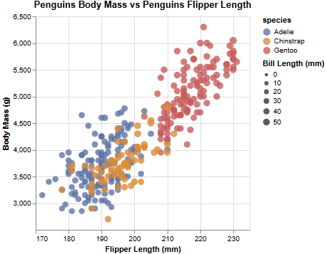
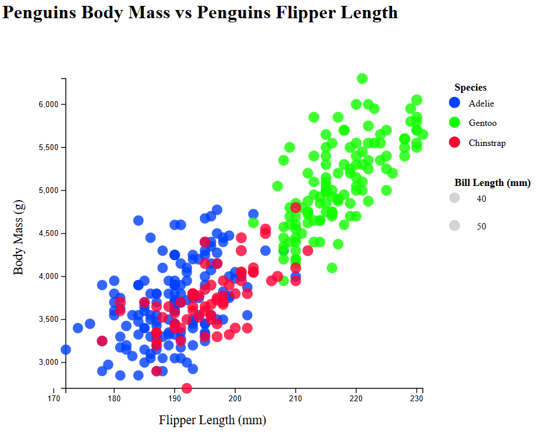
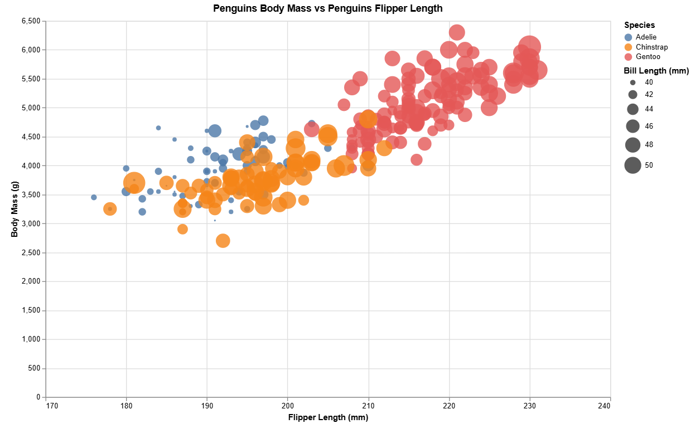

# Assignment 2 - Data Visualization, 5 Ways 
# Skyler Lin 
===

This project pushed me to understand data visualization tools in the data visualization commmunity better. The 5 tools that aI chose each had some learning curve to them, in the end it was worth it because I learned alot about which ones I preferred and didn't prefer going forward. 

## Altair 

Altair was one of the easier tools to get started with because it uses a lot of declarative syntax that closely matches how charts can be described in a concetual way. Mapping the values for the x-axis, y-axis, colors, and size was very straightforward. Adjusting axis domains and the tick values was very intuitive. One challenge was trying to understand that size encoding in Altair represents area rather than radius for those values, which required adjusting the scale range to make size differences clear, I could see how Altair can ve useful when rapid prototyping and maybe in more Python heavy workflows. 

## d3 

D3 was the most flexible and standard tool I worked with out of all 5. However I found it kind of hard. Everything from trying to load the CSV file to defining the scales and margins had to be done completely manual. While this made the process more time-consuming, it also gave me complete control over the layout and styling of the visualization. Creating custom legends for both species and bill length also required additional logic and careful positioning outside of the intended plot area. However, I believe that D3 would be the most useful visualization tool if you wanted to customize interative visualizations where more control is needed. 

## ggPlot2

Using ggPlot 2 in R was really straightforward as it was very structuredand consistent thanks to the grammar and graphics. Once I loaded the data, creating the scatter plot with color and size mappings was concise and very readable. Adjusting the labels and scales was easy to accomplish though with some tuning I was able to get the axis limits and legend formatting better. ggplot2 seemed well suited for statistical contexts. 

## PowerBI 

Power BI required little to no code, which made it quick to create a basic version of the visualization. Drag and drop encodings made it easy to assign axes, color, and size. However, achieving precise control over axis ticks and size scaling was more difficult compared to code based tools. Power BI feels best suited for business dashboards where interactivity and integration with data sources matter more than low-level customization.

## VegaLite 

VegaLite offered a strong balance between control and simplicity. Like Altair, it is declarative, but working directly with the JSON specification made the underlying visualization model more explicit. Setting chart dimensions, axis ticks, legends, and size scaling was straightforward once the schema was understood. Vega-Lite would be particularly useful for web-based visualizations and for sharing standardized, reproducible chart specifications.

## Technical Achievements
- **Proved P=NP**: Using a combination of...
- **Solved AI Forever**: ...

### Design Achievements
- **Re-vamped Apple's Design Philosophy**: As demonstrated in my colorscheme...
